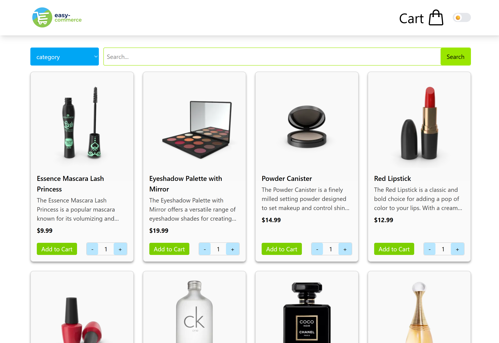
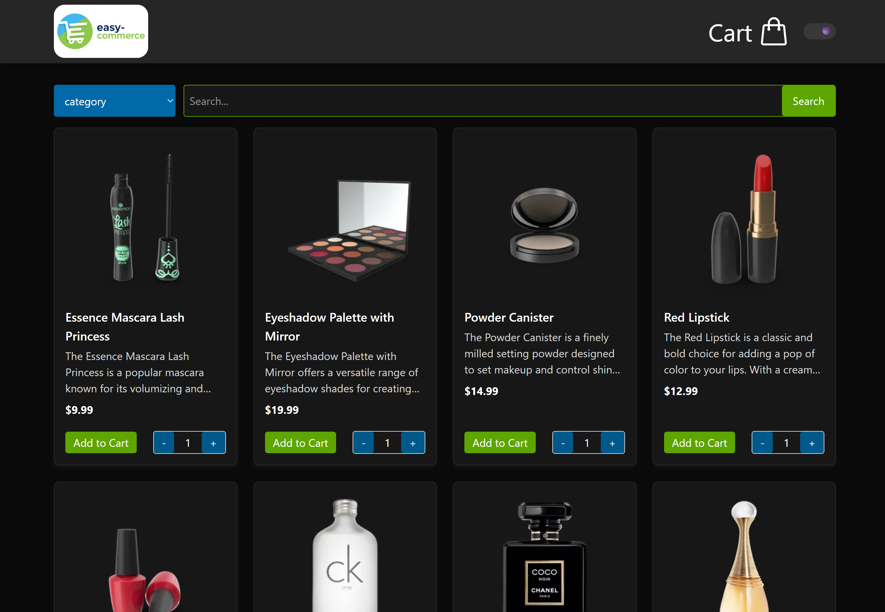
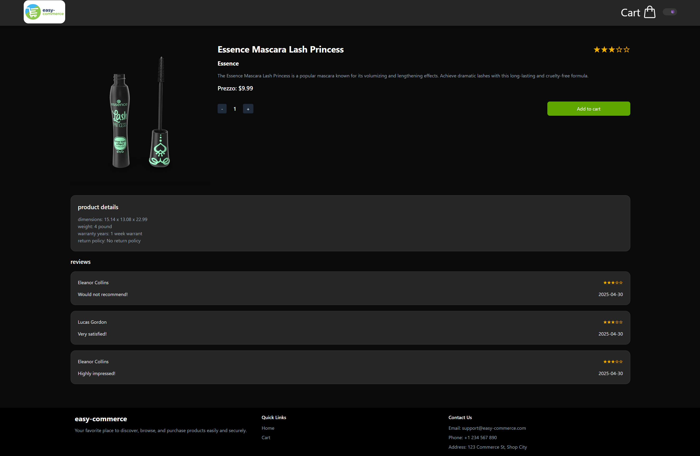
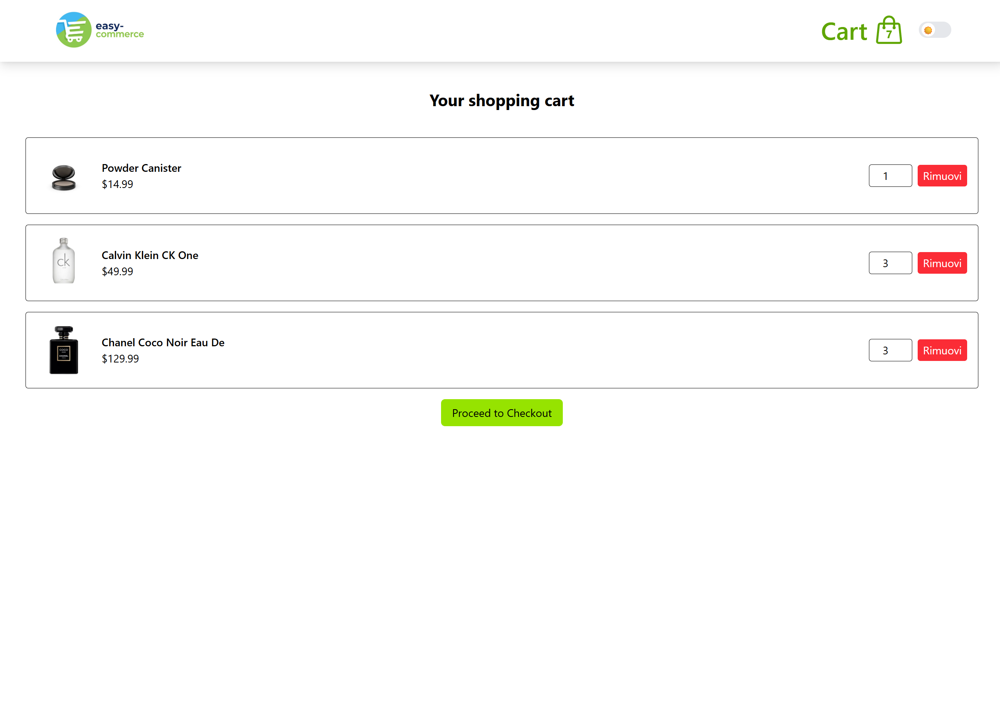

# easy-commerce

Applicazione **React** che implementa un semplice e-commerce basato sulle API di [DummyJSON](https://dummyjson.com).  
Il progetto è stato sviluppato seguendo un approccio **TDD (Test-Driven Development)**, con attenzione a performance, chiarezza del codice e user experience.

## Funzionalità principali

- **Vetrina prodotti**

  - Paginazione con un numero limitato di prodotti per pagina
  - Filtraggio per categoria
  - Ricerca generica per nome o descrizione
  - Pagina di dettaglio dedicata per ogni prodotto

- **Carrello**

  - Aggiunta di prodotti
  - Rimozione di prodotti
  - Aggiornamento delle quantità
  - Stato sincronizzato con le API di DummyJSON

- **UI e UX**

  - Stile realizzato con **Tailwind CSS**
  - Layout **responsive** ottimizzato per diverse dimensioni di viewport (mobile, tablet, desktop)
  - Toggle per passaggio tra modalità **chiara** e **scura**

- **Ottimizzazione**
  - Gestione asincrona e caching tramite **@tanstack/react-query**

## Tecnologie utilizzate

- **Framework:** React
- **Testing:** Vitest + React Testing Library
- **Stile:** Tailwind CSS
- **Gestione query e caching:** @tanstack/react-query

## Sviluppo

- Architettura modulare e scalabile
- Implementazione guidata dai test (TDD)
- test significativi a copertura delle feature principali:
  - ricerca
  - paginazione
  - filtraggio
  - carrello
  - pagina prodotto
  - caching

## Installazione e avvio

- clona repository
- esegui `npm install`
- esegui `npm run dev` per avviare l'applicazione e renderla visionabile nel browser
  -esegui `npm run test` o `npm run test:ui` per eseguire i test

## Screenshots

